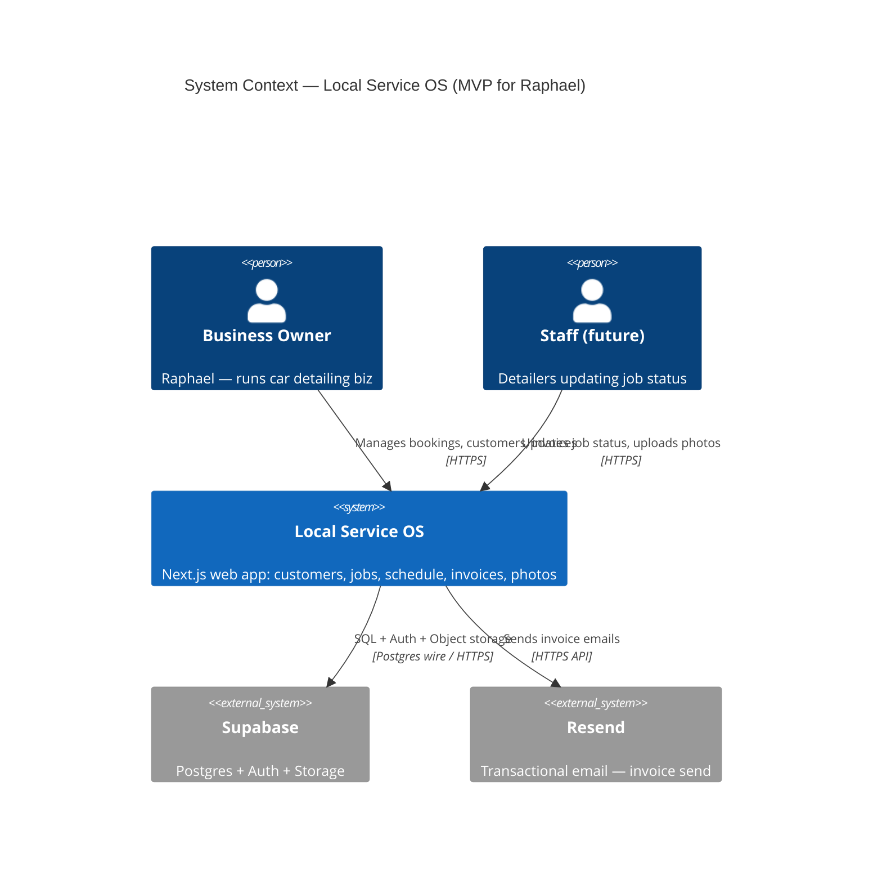
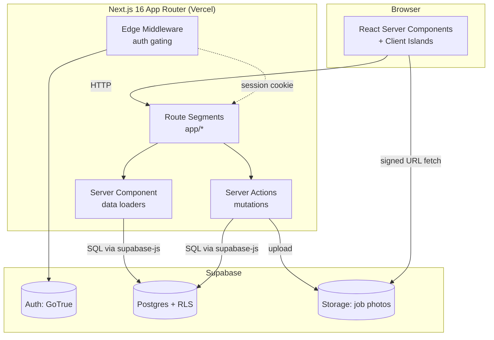
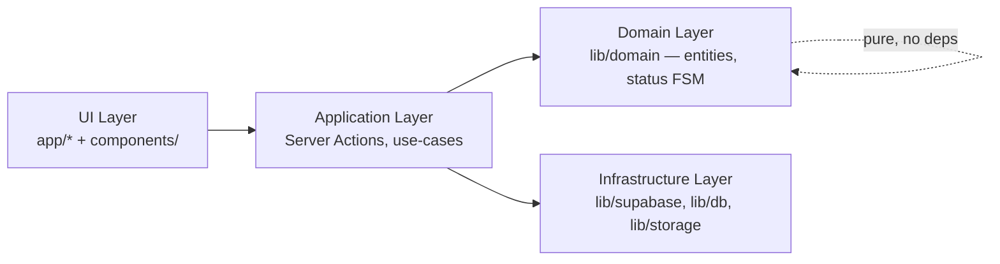
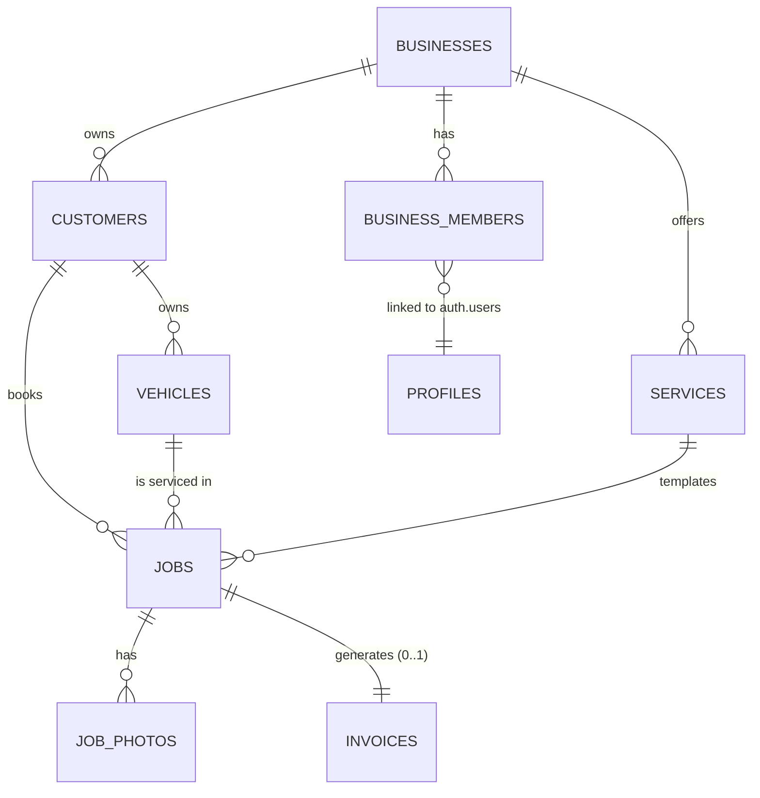
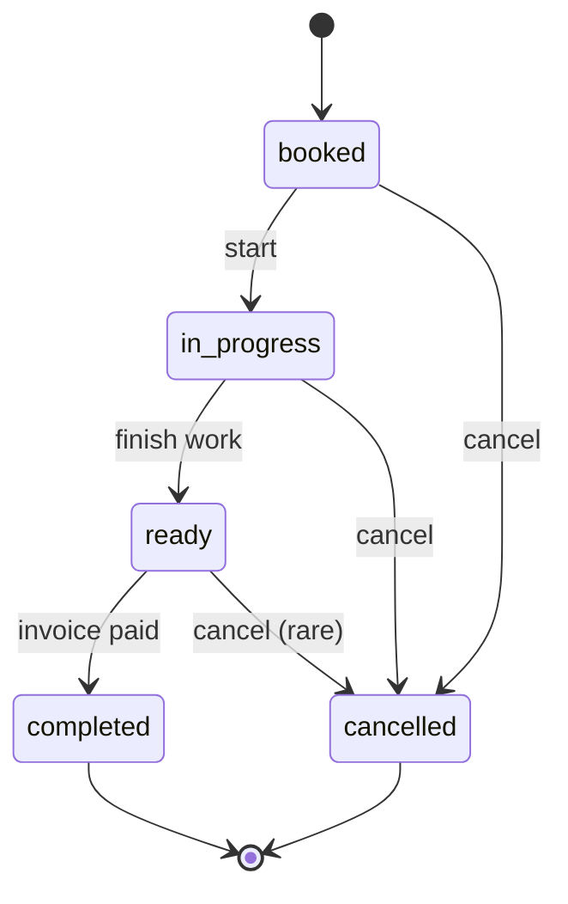
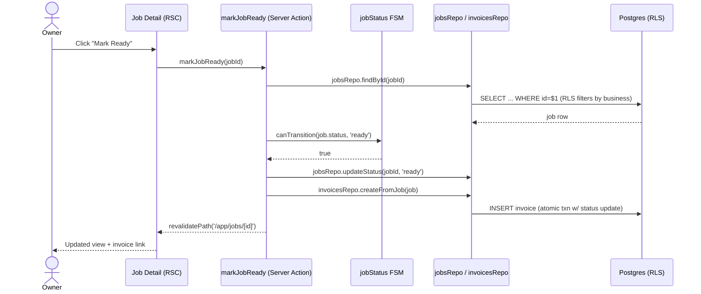
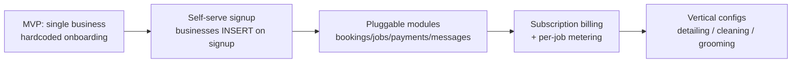

# High-Level Design — Local Service OS

This document captures the high-level architecture of the MVP as diagrams-as-code
(Mermaid) annotated with the software engineering patterns each piece applies.

The MVP target is Raphael's car detailing business, but the foundation is
designed to evolve into a multi-tenant SaaS for small local service businesses.

---

## 1. System Context (C4 Level 1)



**Pattern:** *C4 Model* — context → container → component → code. Keeps
stakeholders aligned without UML soup.

---

## 2. Container View (C4 Level 2)



**Patterns applied:**

- **BFF (Backend-for-Frontend):** Next.js server layer *is* the BFF — no separate API tier.
- **CQRS-lite:** Server Components read; Server Actions write. Different code paths, same store.
- **Gateway/Edge Auth:** Middleware enforces "must be authenticated" before route handlers run.

---

## 3. Layered Module Architecture



**Pattern:** *Hexagonal / Ports & Adapters* (lightweight). The `domain/` layer
owns business rules (e.g., job status transitions, invoice number generation)
and depends on **nothing** — Supabase is an adapter behind a port.

When Supabase is eventually swapped for self-hosted Postgres or a second
storage backend is added, only `lib/supabase/*` changes. Domain rules stay
untouched.

---

## 4. Domain Model



**Pattern:** *Multi-tenant by discriminator column* — every operational table
carries `business_id`. RLS enforces it. Cheaper than schema-per-tenant;
sufficient for thousands of SMBs.

---

## 5. Job Status — Finite State Machine



**Pattern:** *State Machine* — encoded in `lib/domain/jobStatus.ts`, not
scattered through UI conditionals. Invalid transitions throw before they hit
the DB.

```ts
// lib/domain/jobStatus.ts — the FSM as code
export type JobStatus = 'booked' | 'in_progress' | 'ready' | 'completed' | 'cancelled';

const TRANSITIONS: Record<JobStatus, JobStatus[]> = {
  booked:      ['in_progress', 'cancelled'],
  in_progress: ['ready', 'cancelled'],
  ready:       ['completed', 'cancelled'],
  completed:   [],
  cancelled:   [],
};

export function canTransition(from: JobStatus, to: JobStatus): boolean {
  return TRANSITIONS[from].includes(to);
}
```

---

## 6. Core Use-Case Flow — "Mark Job Ready → Generate Invoice"



**Patterns:**

- **Repository Pattern** — `jobsRepo`, `invoicesRepo` hide SQL.
- **Unit of Work** — both writes wrapped in a Postgres transaction (via
  `supabase.rpc` or a server-side `pg` txn) so a failed invoice doesn't leave
  a half-updated job.
- **Server Action as Use-Case Handler** — one function = one business
  operation.
- **Pricing as a pure function** — the invoice amount is snapshotted from
  `jobTotal(job)` = `price − discount + extra` (fixed-amount adjustments only;
  no percentages or coupons). Keeping the total a pure derivation means the
  job detail view and the invoice always agree.

---

## 7. Folder Structure (mapped to layers)

```
app/                          ← UI Layer (route segments)
  (auth)/login/
  app/
    dashboard/page.tsx        ← Server Component (read)
    jobs/[id]/
      page.tsx                ← Server Component
      actions.ts              ← Server Actions (write) — use-case handlers
components/
  ui/                         ← shadcn primitives (presentational)
  forms/  tables/  layout/    ← composed components
lib/
  domain/                     ← Pure business rules — NO supabase import
    jobStatus.ts
    invoiceNumber.ts
    pricing.ts
  db/                         ← Repository pattern (ports)
    jobsRepo.ts
    customersRepo.ts
    invoicesRepo.ts
  supabase/                   ← Adapter — server & browser clients
    server.ts                 ← cookies()-aware server client
    browser.ts                ← anon client for client components
  storage/
    jobPhotos.ts              ← signed URLs, upload helpers
  utils/
types/                        ← Generated from supabase + domain types
supabase/migrations/          ← SQL — source of truth for schema + RLS
docs/                         ← HLD lives here
```

---

## 8. Cross-Cutting Concerns

| Concern          | Pattern / Mechanism                                                                    | Location                          |
| ---------------- | -------------------------------------------------------------------------------------- | --------------------------------- |
| Tenant isolation | RLS policies keyed on `business_id` via JWT claim                                      | `supabase/migrations/*_rls.sql`   |
| AuthN            | Supabase Auth + Next.js middleware (Edge)                                              | `middleware.ts`                   |
| AuthZ (future)   | Role on `business_members.role` → policy predicate                                     | RLS                               |
| Validation       | Zod schemas at Server Action boundary (anti-corruption)                                | `app/**/actions.ts`               |
| Errors           | Result type (`{ ok, data } \| { ok: false, error }`) for actions; throw inside domain  | `lib/domain/result.ts`            |
| Observability    | Server Action wrapper logs `{ business_id, user_id, action, duration }`                | `lib/obs/withLogging.ts`          |
| Idempotency      | Invoice number = `INV-{businessSlug}-{yyyymm}-{seq}` via DB sequence                   | `invoicesRepo.createFromJob`      |

**Patterns:**

- **Anti-Corruption Layer** (Zod at action boundary) — untrusted form data
  never reaches the domain unparsed.
- **Decorator** (`withLogging`, future `withAuth`, `withTenant`) — wraps
  Server Actions without polluting use-case code.
- **Result Type** instead of exceptions across the UI boundary — keeps error
  UI deterministic.

---

## 9. Evolution Path (SaaS-ready seams)



**Pattern:** *Strangler Fig* — each future module (`payments/`, `messaging/`,
`ai/`) is added as a sibling under `lib/domain/` and `app/app/`, never by
rewriting existing flows.

The FSM transition `ready → completed` is the natural metering hook for the
`$5 per completed job` billing line. Emitting a domain event there (even just
`INSERT INTO billing_events`) makes future Stripe metering a small job, not
a refactor.
