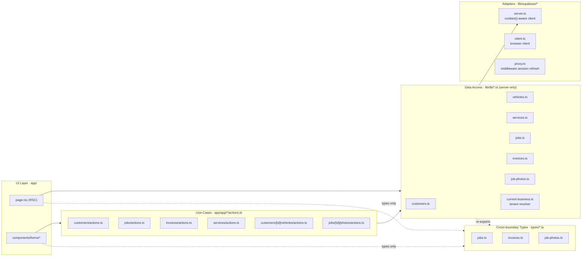
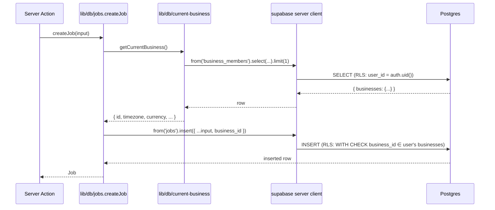
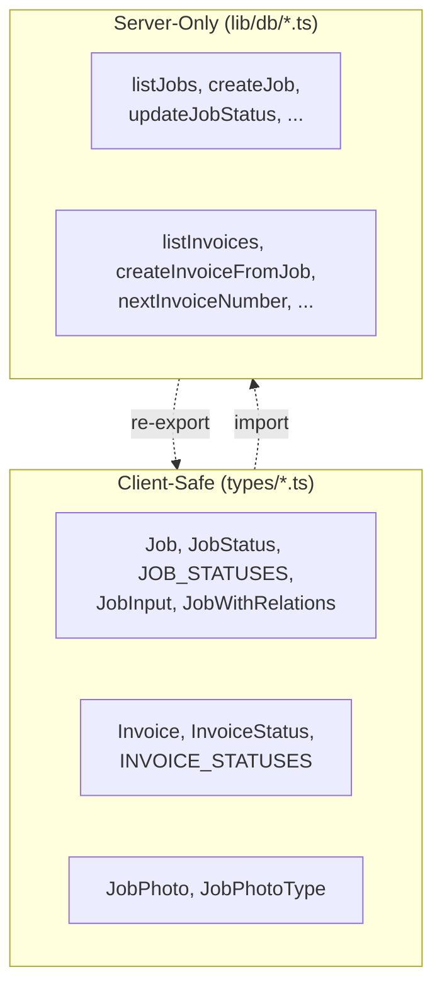
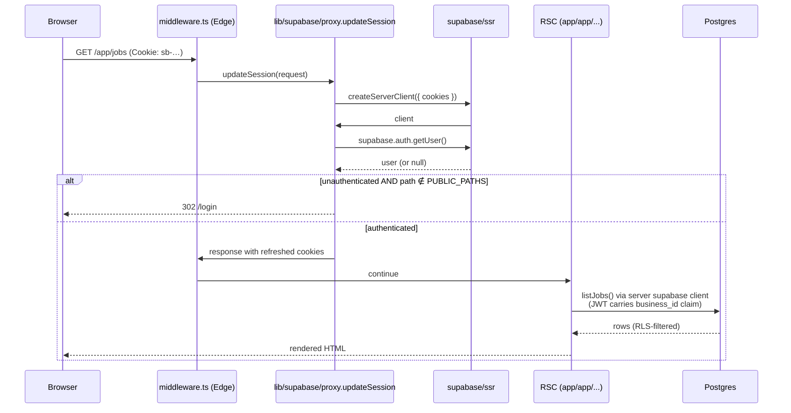
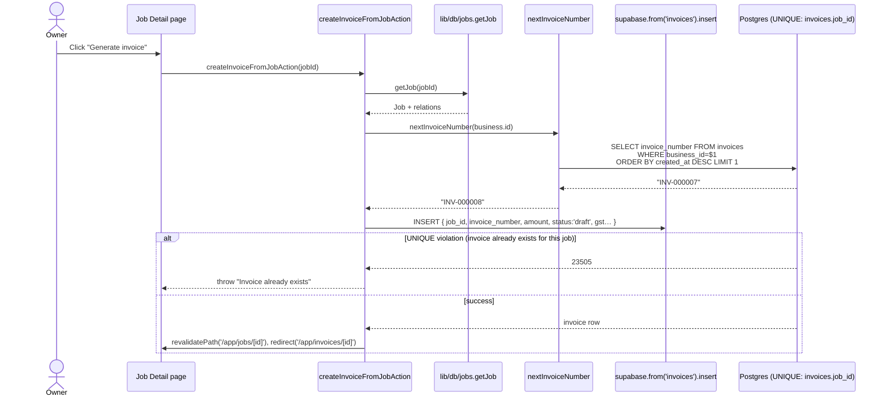
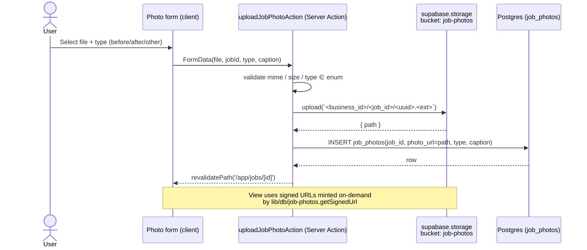
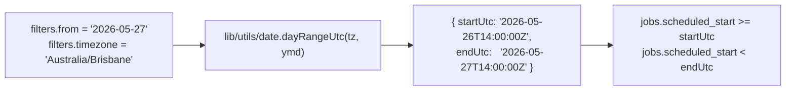

# Low-Level Design — Local Service OS

Companion to [HLD.md](./HLD.md). Where the HLD answers *"how is the system
shaped?"*, this LLD answers *"what does each module look like and how does
data flow through it?"*.

All signatures, file paths, and behaviors below reflect the **actual
codebase** as of this commit — not aspirational design. When the code and
this doc disagree, the code wins; update the doc.

---

## 1. Module Map (concrete)



**Key conventions enforced by file layout:**

- `lib/db/*.ts` import `"server-only"` on line 1 — bundler rejects them in
  client code, so RLS context can't accidentally leak to the browser.
- `types/*.ts` contain **only** types and `as const` arrays — safe to import
  from any layer.
- `lib/db/*.ts` re-export the relevant types from `types/*.ts` so callers
  inside the server boundary don't need a separate import line.

---

## 2. Server Action — Anatomy

Every mutating Server Action follows the same four-phase shape. Example:
[app/app/jobs/actions.ts](../../app/app/jobs/actions.ts).

```ts
"use server";                                  // ① boundary marker

import { revalidatePath } from "next/cache";
import { createJob, type JobInput } from "@/lib/db/jobs";

// ② parse + validate FormData → typed input
function parseJobForm(formData: FormData): JobInput {
  const customer_id = String(formData.get("customer_id") ?? "").trim();
  if (!customer_id) throw new Error("Customer is required.");
  // ... optionalString / optionalPrice / optionalDateTime helpers
  return { customer_id, /* … */ };
}

// ③ the use-case: parse → call repository → revalidate cache
export async function createJobAction(formData: FormData) {
  const input = parseJobForm(formData);
  await createJob(input);
  revalidatePath("/app/jobs");
  revalidatePath("/app/dashboard");
}
```

```mermaid
flowchart LR
    Form["<form action={createJobAction}>"] -->|FormData| Action[Server Action]
    Action -->|parse + validate| Input[JobInput]
    Input --> Repo[lib/db/jobs.createJob]
    Repo -->|supabase.from('jobs').insert| DB[(Postgres + RLS)]
    Action -->|revalidatePath| Cache[Next.js Cache]
```

**Patterns:**

- **Anti-Corruption Layer** — `parseJobForm` is the only place untyped
  `FormData` is allowed; everything downstream sees typed `JobInput`.
- **Cache-as-state** — no manual store invalidation; `revalidatePath` is the
  single source of "this view needs to re-render".
- **Throw-for-errors** — Server Actions surface a thrown `Error` to the
  enclosing error boundary; no `Result<T, E>` wrapper at this layer yet.

---

## 3. Repository Module — Shape

Each `lib/db/<entity>.ts` exposes a consistent verb set, all `async`, all
implicitly scoped by tenant via RLS:

```ts
// lib/db/jobs.ts (excerpt — actual signatures)
import "server-only";
import { createClient } from "@/lib/supabase/server";
import { getCurrentBusiness } from "@/lib/db/current-business";

const RELATIONS =
  "*, customer:customers(id, name), vehicle:vehicles(id, make, model, year, color, plate), service:services(id, name, base_price)";

export type ListJobsFilters = {
  status?: JobStatus | "all";
  from?: string;       // YYYY-MM-DD in business timezone
  to?: string;
  timezone?: string;
  customerId?: string;
};

export async function listJobs(filters?: ListJobsFilters): Promise<JobWithRelations[]>;
export async function getJob(id: string): Promise<JobWithRelations | null>;
export async function createJob(input: JobInput): Promise<Job>;
export async function updateJob(id: string, input: Partial<JobInput>): Promise<Job>;
export async function deleteJob(id: string): Promise<void>;
export async function updateJobStatus(id: string, status: JobStatus): Promise<Job>;
```

**Tenant scoping** is **not** done by passing `business_id` into every
function. It happens two ways:

1. **Reads** — RLS policies on the Supabase JWT filter rows automatically.
2. **Writes** — `getCurrentBusiness()` is called inside `create*` to stamp
   `business_id` on the new row before insert.



**Failure mode worth knowing:** if `getCurrentBusiness()` returns `null`
(user has no `business_members` row yet), `create*` calls throw. The
onboarding flow that inserts that row is currently manual (seed SQL) — see
[supabase/seed.sql](../../supabase/seed.sql).

---

## 4. Type Boundaries



**Rule:** if a symbol is used in a `'use client'` file or a Server Component
that renders into the browser bundle, it must live in `types/`. Pure server
helpers live in `lib/db/` and may never be imported from a client component
(enforced by `"server-only"`).

---

## 5. Auth & Session — Request Lifecycle



**Patterns:**

- **Gateway / Edge Auth** — the middleware proxy is the single chokepoint
  where unauthenticated traffic is bounced. Pages don't re-check.
- **Token-refresh-on-read** — `getUser()` inside the proxy refreshes the
  session cookie on every request, so long-idle tabs don't 401 mid-action.
- **PUBLIC_PATHS allowlist** — `/login` and `/auth/*` are the only routes
  that skip the gate; everything else is private by default.

---

## 6. Invoice Generation — Detailed Flow

This is the highest-stakes use-case (it's also the `$5 per completed job`
billing trigger). Implemented in
[lib/db/invoices.ts](../../lib/db/invoices.ts) and
[app/app/invoices/actions.ts](../../app/app/invoices/actions.ts).



**Known trade-offs documented here, not hidden in comments:**

| Concern | Current MVP behavior | Future fix |
|---|---|---|
| Invoice number race condition | `MAX(invoice_number)+1` — two concurrent calls can collide on the next-number lookup, but the `UNIQUE (business_id, invoice_number)` index will reject the second insert | Move to a per-business Postgres `SEQUENCE` or `INSERT … RETURNING` with a CTE |
| One invoice per job | Enforced by `UNIQUE (job_id)` (migration `0003`) — second attempt throws | Allow voids + re-issue once void/credit flow exists |
| GST calculation | Computed at insert time from amount + flag (migration `0006`) | Add line-item invoices when multi-service jobs land |
| Email send | Not implemented — `sent_at` is set by a manual "Mark as sent" action | Hook a queue + provider (Postmark/Resend) |

---

## 7. Photo Upload — Storage Adapter



**Patterns:**

- **Object key as tenant prefix** — `<business_id>/<job_id>/<uuid>` makes
  bucket-level RLS trivial and accidental cross-tenant access impossible
  even if a code path forgets to filter.
- **Signed URLs over public** — photos are operational data, not marketing
  assets; URLs expire (default 1h) so leaked links rot quickly.

---

## 8. Schedule View — Timezone Handling

The trickiest piece of read-side logic. The business's local calendar day
(e.g. `2026-05-27` in `Australia/Brisbane`) must map to the correct UTC
range for the `scheduled_start` timestamptz column.



**Why this matters:** if `dayRangeUtc` is wrong, a job scheduled at 11pm
local time disappears from "today" and reappears in "tomorrow". Worth a
dedicated unit test before any timezone-sensitive feature lands.

---

## 9. Error Strategy (current state)

| Layer | What it does on error |
|---|---|
| `lib/db/*.ts` | Throws on Supabase `error` — never returns `null` for unexpected failures (only for "not found") |
| Server Actions | Let throws propagate to Next.js error boundary; `redirect()` and `revalidatePath()` only fire on success |
| Forms (UI) | No client-side validation library yet — relies on HTML5 `required` + server-side throws shown via `error.tsx` |
| RLS denial | Surfaces as `PGRST116` / empty result — treated as "not found" by repositories |

**Gap to close:** there is no consistent way for forms to render
field-level validation errors. When this becomes painful (≈ first form
with >5 fields and conditional rules), introduce `zod` + a `useFormState`
wrapper at the action boundary.

---

## 10. Migration Inventory

| Migration | Purpose |
|---|---|
| `0001_init.sql` | Core schema: businesses, business_members, customers, vehicles, services, jobs, job_photos, invoices + RLS scaffolding |
| `0002_job_photos_storage.sql` | Storage bucket + policies for photo uploads |
| `0003_invoices_job_unique.sql` | `UNIQUE (job_id)` on invoices — prevents duplicate invoice generation |
| `0004_businesses_contact_fields.sql` | ABN, email, phone, address, logo_url on businesses (needed for printable invoices) |
| `0005_data_quality_constraints.sql` | NOT NULL + CHECK constraints tightening MVP assumptions |
| `0006_invoices_gst.sql` | GST breakdown columns for Australian tax compliance |

Migrations are the **authoritative schema** — types in `types/*.ts` are
hand-written to match. When that drift becomes painful, switch to
`supabase gen types typescript`.

---

## 11. Open Design Questions (deliberately deferred)

1. **Concurrency on invoice numbers** — accept MVP races; revisit when a
   second business onboards.
2. **Soft delete vs hard delete** — currently hard-delete; jobs FK to
   invoices is handled (commit `142853d`). Revisit if Raphael ever asks
   "where did that customer go?".
3. **Multi-business switching UI** — `getCurrentBusiness()` is a stub for
   single-business assumption. Real fix is a `default_business_id` on
   `profiles` + a switcher in the layout.
4. **Background jobs** — none yet. First need will likely be invoice email
   send; pick `pg-boss` or Supabase Edge Functions then.
5. **Audit trail** — no `audit_log` table yet. Add when staff role lands
   and "who changed this?" becomes a real question.
